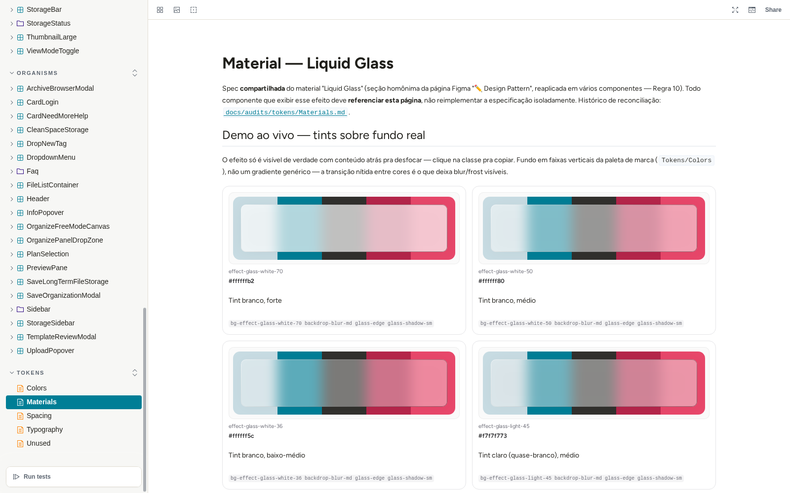
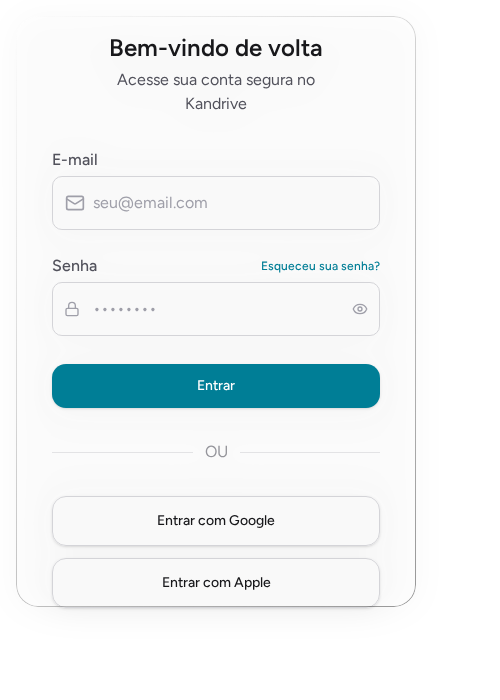
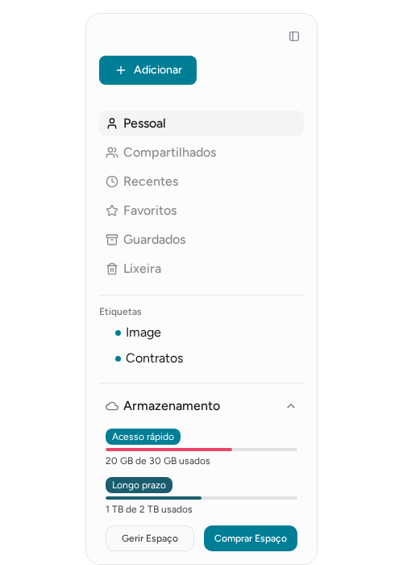
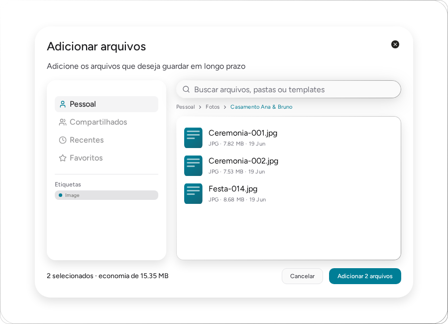
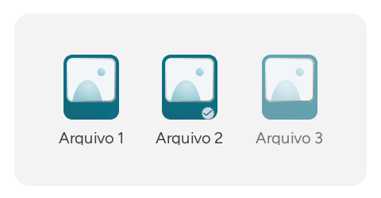
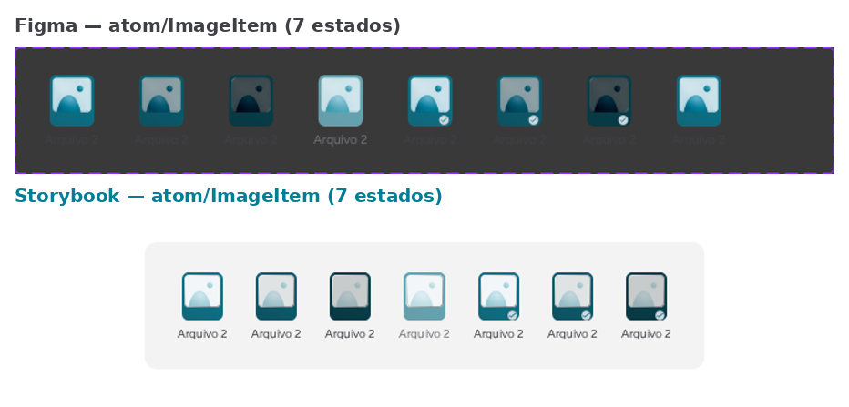
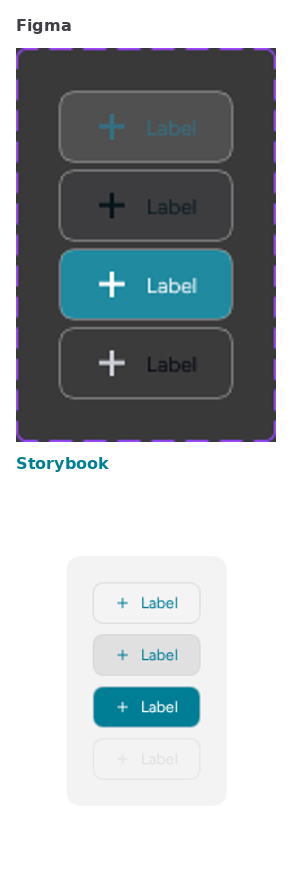

# Kandrive Design System

**[Storybook ao vivo →](https://kandrive-design-system.vercel.app)** · [Case study de pesquisa UX](docs/CASE-STUDY.md) · [Fonte da pesquisa (nexus)](https://github.com/thomasreichmann/nexus)

Design system em Storybook pro **Kandrive** — um SaaS conceitual de
armazenamento massivo e de longo prazo (cold storage sobre AWS S3
Glacier), nascido de uma pesquisa de UX real (desk research, netnografia,
survey e teste de usabilidade com 4 participantes — [case study
completo](docs/CASE-STUDY.md)).



Stack: React 19 + TypeScript + Tailwind CSS v4 + shadcn/ui (Radix + CVA) +
Storybook 10 (CSF3 + MDX).

## O que tem aqui

~85 componentes organizados por camada atômica (atoms → molecules →
organisms), cada um com:

- Estados reais e interativos (hover/press/seleção via mouse e teclado —
  não só uma prop `state` congelada pra documentação)
- Doc `.mdx` própria citando o node Figma de origem e o nível de confiança
  de cada decisão (Figma-confirmado vs. inferido — ver `Regra 9` abaixo)
- Página de tokens (`Tokens/Colors`, `Typography`, `Spacing`, `Materials`)
  com especime visual real e valor copiável ao clicar, não só uma tabela

| | | |
|---|---|---|
|  |  |  |

## Interatividade real, não simulada

Boa parte da auditoria deste projeto foi caçar um antipadrão específico:
componentes cujos estados (`hover`/`pressed`/`selected`) só existiam como
uma prop `state` estática — sem nenhum `:hover` real, sem handler de
clique. Bonito no Storybook, inútil como prova de comportamento.



Corrigido em todos os átomos afetados (`ImageItem`, `ArchiveItem`,
`FolderItem`, `VideoItem`, `FileList`, `FolderCard`...): a prop `state`
continua existindo como *override* explícito pra documentação/auditoria
(freeze-frame de um estado específico), mas por padrão o componente reage
a mouse e teclado de verdade — `useState` interno + handlers reais de
`onMouseEnter/Leave/Down/Up/Click/KeyDown`, `role="button"`,
`aria-pressed`.

## Disciplina de fidelidade Figma↔código

Toda implementação segue um protocolo de verificação de 2 pontas antes de
ser considerada "pronta": ler o node real no Figma (`get_design_context` +
`get_metadata` + `get_variable_defs`) **e** conferir o resultado
renderizado via screenshot real (Playwright, não só o build passando).
Isso vale tanto pra evitar inventar valores quanto pra pegar bugs de
CSS que `tsc`/build não detectam.

| | |
|---|---|
|  |  |

Regra do projeto (`Regra 9`): **nunca apresentar inferência como fato**.
Cada peça de UI documentada carrega uma citação literal do Figma quando
existe (`atom/buttonAdd`, node `1421:20509`, etc.) e, quando um detalhe
não está no Figma, isso é documentado explicitamente como gap ou decisão
humana — nunca inventado silenciosamente. Exemplo real desse processo: o
[histórico de reconciliação do material Liquid
Glass](docs/audits/tokens/Materials.md) mostra uma borda que foi
classificada como "provável placeholder" numa auditoria, revista como
"borda real do material" numa seguinte, e revista de novo pra um highlight
direcional de vidro depois de comparação visual mais cuidadosa — o
processo é iterativo e documentado a cada correção, não apagado.

## Processo: engenharia com um agente de IA

Este design system foi construído em colaboração com o Claude Code, num
processo que se parece mais com *tech lead revisando PRs* do que "pedir
pro robô fazer". Na prática isso significou:

- **Protocolo de verificação obrigatório** (acima) antes de qualquer
  implementação ser considerada correta — nenhuma mudança visual é aceita
  só porque o build passou.
- **Achados do usuário viram correções documentadas**, não silenciosas —
  cada arquivo de componente carrega comentários datados explicando *por
  que* uma decisão mudou (ex.: "borda plana → highlight direcional,
  achado do usuário em 2026-08-20").
- **Auditoria sistemática antes de declarar pronto** — handoff pra
  engenharia só foi declarado depois de uma varredura completa checando
  interatividade real, terminologia consistente e fidelidade Figma
  componente a componente.

Orquestrar um agente de IA com esse nível de rigor — sabendo o que
verificar, quando questionar uma correção proposta, e como manter um
histórico de decisões auditável — é, na prática, a mesma habilidade de
revisão de engenharia de sempre, aplicada a um colaborador mais rápido.

## Desenvolvimento

```bash
npm install
npm run storybook       # Storybook em http://localhost:6006
```

## Verificação

```bash
npx tsc --noEmit         # typecheck
npm run build-storybook  # build estático (storybook-static/)
```

## Estrutura

- `stories/atoms`, `stories/molecules`, `stories/organisms` — stories CSF3 +
  MDX por componente, organizadas por camada atômica.
- `stories/tokens` — documentação MDX dos tokens de design (cor, tipografia,
  espaçamento, material).
- `docs/CASE-STUDY.md` — pesquisa de UX que fundamenta o produto (problema,
  personas, teste de usabilidade, decisões de design derivadas).
- `docs/audits/` — histórico de reconciliação Figma↔código por componente e
  por token, separado das docs `.mdx` (que ficam como referência limpa).
- `docs/conflicts.md` — log de conflitos entre o Figma e as decisões de
  design já travadas.
- `docs/checkpoints.md` — checkpoint por camada atômica documentada.
- `docs/terminology-audit.md` — auditoria final de terminologia de UI.

## Deploy (Vercel)

O `vercel.json` já aponta o build para o Storybook estático:

```json
{
  "buildCommand": "npm run build-storybook",
  "outputDirectory": "storybook-static"
}
```

Basta importar este diretório (`design-system/`) como root do projeto na
Vercel — nenhuma configuração adicional é necessária.
