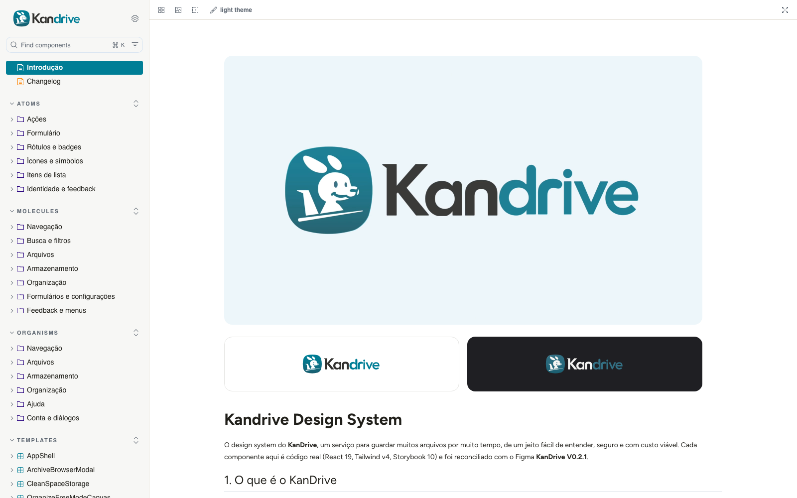
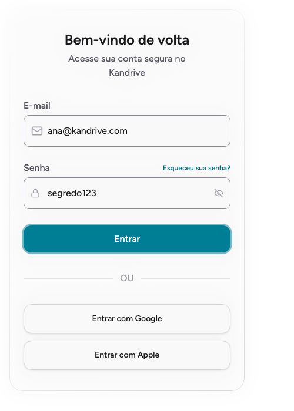
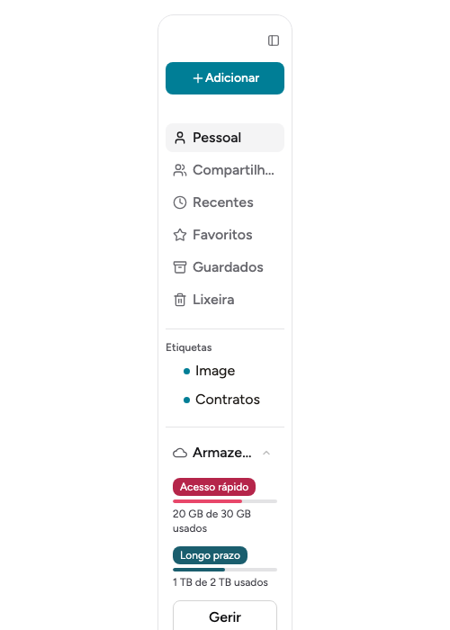
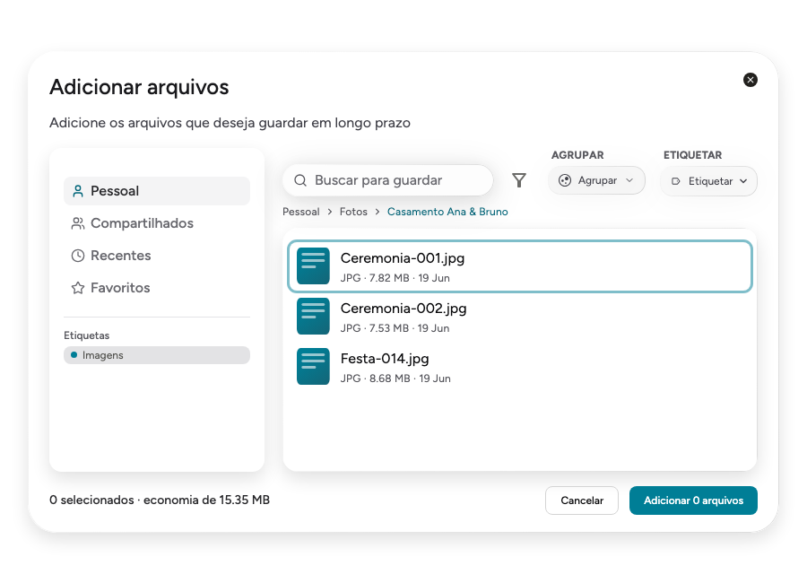
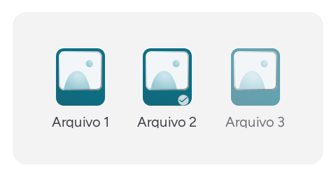
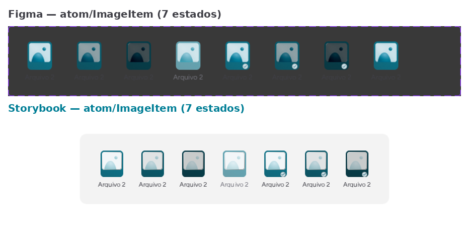
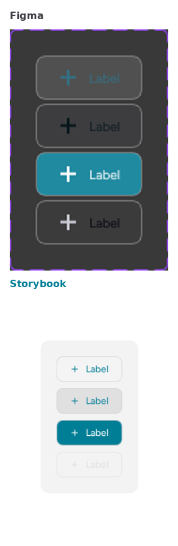

# KanDrive Design System

Sistema de design completo para um SaaS de armazenamento de longo prazo, conectando pesquisa UX, Figma, tokens, componentes React e validação visual em Storybook.

**[Storybook ao vivo](https://kandrive-design-system.vercel.app)** · [Figma KanDrive V0.2.1](https://www.figma.com/design/2g7udqxWbGA8F9Or7PGNg3/KanDrive-V0.2.1) · [Case study de pesquisa UX](docs/CASE-STUDY.md) · [Fonte da pesquisa, Nexus](https://github.com/thomasreichmann/nexus)

O KanDrive é um SaaS conceitual para guardar grandes volumes de arquivos por muito tempo, com uma experiência simples, segura e viável sobre AWS S3 Glacier. Este repositório transforma a pesquisa de UX em um design system navegável, testável e reutilizável.



Stack: React 19 + TypeScript + Tailwind CSS v4 + shadcn/ui (Radix + CVA) + Storybook 10 (CSF3 + MDX).

## Destaques

- 141 componentes organizados em atoms, molecules, organisms, templates e pages.
- Storybook público com documentação, estados, tokens e exemplos por componente.
- Figma KanDrive V0.2.1 como fonte visual, com rastreabilidade por node sempre que disponível.
- Tokens de cor, tipografia, espaçamento, materiais, marca e responsividade.
- Tema claro e escuro via tokens, sem duplicar cores no componente.
- Acessibilidade verificada com axe, contraste como erro e alvos de toque de 44px no Mobile.
- Comparações Figma x Storybook e verificação visual por screenshot real.
- Pesquisa UX documentada em case study, com desk research, netnografia, survey e teste de usabilidade.

## O que avaliar primeiro

1. **Storybook ao vivo:** veja a navegação por camadas, Docs e exemplos interativos.
2. **Figma:** confira a origem visual, telas e protótipo do KanDrive V0.2.1.
3. **Case study:** entenda o problema, a pesquisa e as decisões de produto.
4. **Índice de componentes:** use [docs/COMPONENTS.md](docs/COMPONENTS.md) para localizar rapidamente cada componente.
5. **Guia de uso:** siga [docs/USAGE.md](docs/USAGE.md) para copiar a biblioteca para outro projeto.

## Como usar a biblioteca

Este repositório não é um pacote npm. O modelo é parecido com shadcn/ui: você copia `src/components`, `src/lib`, `src/assets` e `src/index.css` para um projeto React 19 com Tailwind v4, Vite e alias `@/`, e importa os componentes por caminho.

```tsx
import { Button } from "@/components/atoms/button"

<Button variant="outline">Gerir espaço</Button>
```

Documentação de apoio:

- **Pessoas:** [docs/USAGE.md](docs/USAGE.md) ensina a preparar o projeto, montar uma tela com `AppShell`, escolher componentes, usar tokens, tema escuro, terminologia e tom de voz.
- **Agentes de IA:** [AGENTS.md](AGENTS.md) resume as regras, onde procurar evidência, como usar Storybook/MCP e o que verificar antes de declarar uma tarefa pronta.
- **Catálogo:** [docs/COMPONENTS.md](docs/COMPONENTS.md) lista os 141 componentes com arquivo e página Docs.

## O que tem aqui

141 componentes organizados por camada atômica, de atoms a pages. Cada componente inclui:

- Estados reais e interativos, como hover, press, seleção, teclado e disabled.
- Documentação `.mdx` com Figma de origem, uso, props, estados e terminologia.
- Nível de confiança explícito para decisões confirmadas no Figma versus decisões inferidas.
- Tokens visuais com amostra real e valor copiável.
- Histórias pensadas para validação visual, não apenas para demonstração estática.

| | | |
|---|---|---|
|  |  |  |

## Interatividade real, não simulada

Uma parte importante da auditoria foi remover um antipadrão comum em design systems: componentes que parecem corretos no Storybook, mas só exibem estados congelados por prop, sem comportamento real.



Os átomos afetados, como `ImageItem`, `ArchiveItem`, `FolderItem`, `VideoItem`, `FileList` e `FolderCard`, mantêm a prop `state` como override explícito para documentação e auditoria. Por padrão, porém, eles respondem a mouse e teclado com estado interno, handlers reais, `role="button"` e `aria-pressed` quando aplicável.

## Fidelidade Figma x código

A implementação segue um protocolo de verificação em duas pontas antes de ser considerada pronta.

| Etapa | Evidência esperada |
|------|---------------------|
| Fonte visual | Node real no Figma, com contexto, metadados e variáveis quando disponíveis |
| Implementação | Componente React com Tailwind e tokens do sistema |
| Verificação | Screenshot real via Playwright ou Storybook publicado |
| Documentação | Página Docs, comentários datados quando necessário e registro em changelog/vault |

Isso evita inventar valores e ajuda a detectar problemas que typecheck e build não pegam, como diferenças de espaçamento, bordas, contraste, vidro ou comportamento responsivo.

| | |
|---|---|
|  |  |

Regra do projeto: nunca apresentar inferência como fato. Cada peça documentada carrega uma citação literal do Figma quando existe. Quando o detalhe não está no Figma, ele é tratado como gap ou decisão humana, sem virar “fato” silencioso.

## Processo com IA, revisão humana e rastreabilidade

O design system foi construído em colaboração com agentes de IA, mas com o rigor de revisão de engenharia e design:

- Nenhuma mudança visual é aceita apenas porque o build passou.
- Achados do usuário viram correções documentadas, não ajustes invisíveis.
- Comentários datados registram por que uma decisão mudou quando isso afeta fidelidade visual ou regra do sistema.
- Auditorias verificam interatividade real, terminologia, acessibilidade e aderência ao Figma componente a componente.

A orquestração de IA aqui é tratada como prática de design engineering: especificar bem, revisar criticamente, validar com evidência e manter histórico auditável.

## Rodar localmente

```bash
npm install
npm run storybook
```

Acesse:

```text
http://localhost:6006
```

## Verificação

```bash
npx tsc -b               # typecheck
npx oxlint               # lint
npm test                 # 510 testes das histórias no navegador, com axe
npm run check:motion     # todo movimento respeita prefers-reduced-motion
npm run check:touch      # alvos de toque de 44px no Mobile
npm run check:docs       # Docs sem conteúdo vazando da coluna em 1440px
npm run docs:components  # regenera docs/COMPONENTS.md
npm run build-storybook  # build estático em storybook-static/
```

## Estrutura

- `stories/atoms`, `stories/molecules`, `stories/organisms`, `stories/templates`, `stories/pages`: histórias CSF3 + MDX por componente, organizadas por camada atômica.
- `stories/tokens`: documentação MDX dos tokens de design.
- `src/components`: componentes React organizados pelas mesmas camadas do Storybook.
- `src/index.css`: tokens, tema, breakpoints e materiais como Liquid Glass.
- `docs/USAGE.md`, `docs/COMPONENTS.md` e `AGENTS.md`: guia de uso, índice de componentes e guia rápido para agentes.
- `docs/CASE-STUDY.md`: pesquisa de UX que fundamenta o produto.
- `docs/vault/`: resumo vivo de regras, glossário, decisões e conflitos ainda em aberto.

## Making-of

O rastro completo de auditoria e processo vive em um repositório separado de making-of, com checkpoints, conflitos, inventário Figma, auditorias e manifestos pass-a-pass. Este repositório mantém o design system enxuto para entrega, enquanto `docs/vault/` preserva o resumo vivo e atualizado das decisões mais importantes.

Comentários históricos em `src/components/**/*.tsx` continuam válidos mesmo quando citam caminhos do making-of movidos para fora deste repositório.

## Licença

O **código** é MIT ([LICENSE](LICENSE)): pode usar, copiar e adaptar. A **identidade visual do KanDrive** (logo, mascote Kan, ilustrações, padrões gráficos e vídeo de abertura) e o **texto e as imagens do case de UX** não entram na MIT e ficam com todos os direitos reservados. Os caminhos exatos estão no fim do arquivo `LICENSE`.

## Deploy na Vercel

O `vercel.json` já aponta o build para o Storybook estático:

```json
{
  "buildCommand": "npm run build-storybook",
  "outputDirectory": "storybook-static"
}
```

Basta importar este repositório como root do projeto na Vercel. Nenhuma configuração adicional é necessária.
