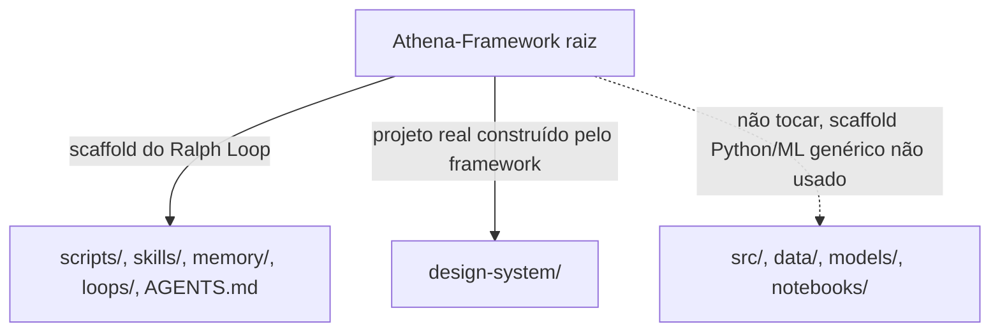

# Athena Framework

O repositório raiz (`Athena-Framework`, GitHub `nandoantonio-git/Athena-Framework`) é um **scaffold reutilizável** para desenvolvimento autônomo orientado por LLM ("Ralph Loop"). Ele e o [[Kandrive Design System|projeto real]] vivem no mesmo repositório, mas são duas coisas distintas sobrepostas:

- **Raiz do Athena** — infraestrutura do [[Ralph Loop]]: lê `scripts/prd.json`, delega implementação a um provider LLM, valida com `scripts/gate.sh`.
- **`design-system/`** — o kandrive-design-system em si: app Node autocontido, com seu próprio `package.json`/`node_modules`/`tsconfig.json`. É onde 100% do trabalho real acontece.
- **`src/`, `data/`, `models/`, `notebooks/`** — scaffold genérico Python/ML herdado do template original do Athena, **não usado neste projeto**. Ignorar.

## AGENTS.md — a "constituição"

`AGENTS.md` na raiz é o contexto injetado em toda sessão do Ralph — as [[Camadas Atômicas|regras travadas]], a [[Fonte Figma|fonte Figma]] e o estado dos componentes ainda não implementados. É gerado por `init.sh` e compactado por `loops/compact.sh` quando cresce demais.

**Read `AGENTS.md` before making any design-system change** — é autoritativo sobre qualquer coisa inferida do código.

## Skill Learning

O framework tem um ciclo de aprendizado de skills a partir de sessões bem-sucedidas:

1. `memory/recorder.py` grava trajetórias de sessão em SQLite.
2. `loops/distill.sh` destila 3+ sessões boas numa skill candidata em `skills/pending/`.
3. Revisão humana promove pra `skills/active/` (injetada em toda sessão) ou descarta.

## Ver também

- [[Ralph Loop]]
- [[Estrutura de Pastas]]
