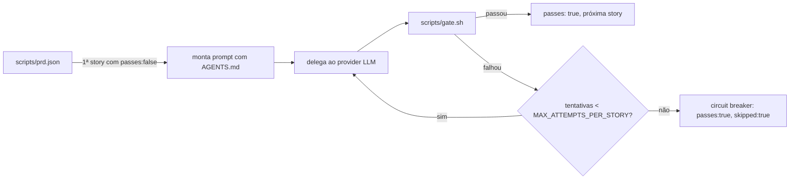

# Ralph Loop

O mecanismo de desenvolvimento autônomo do [[Athena Framework]]. Lê o backlog, implementa uma story por vez, valida, avança.



## Providers (fallback triplo)

| Ordem | Provider | Comando | Notas |
| --- | --- | --- | --- |
| 1 | Codex | `codex` | padrão, danger-full-access |
| 2 | Gemini | `gemini` | fallback, `--yolo` |
| 3 | Claude | `claude` | fallback final |

Preflight check no início testa cada provider na ordem; troca automática se um atingir rate limit ou falhar 3x seguidas na mesma story. Estado em `scripts/.current-provider`.

## Backlog (`scripts/prd.json`)

Editado via skill `/ralph` (converte um PRD em `prd.json`), não à mão. Cada story:
- Implementável numa única iteração/janela de contexto
- Acceptance criteria verificáveis, sempre terminando em `"Typecheck passes"`
- Ordenada por dependência

Ver [[Backlog (User Stories)]] pro estado atual (26/26 concluídas).

## Gate de validação

`scripts/gate.sh` — pro kandrive-design-system, tipo `typescript`:

```bash
(cd design-system && npx tsc --noEmit)
(cd design-system && npm run build-storybook)
```

## Por que esta sessão não usou o Ralph

A [[Sessão 2026-08-15]] (fechamento da US-026, branding, cores, 18 ajustes) foi feita **fora do Ralph**, em sessão interativa direta — a US-026 (auditoria de ponto-fixo) tinha rodado **19 passadas autônomas** sem convergir, cada uma reiniciando o contexto do zero e gastando muito token sem visibilidade pro usuário. Ver [[Sessão 2026-08-15]] pro racional completo.

## Ver também

- [[Athena Framework]]
- [[Backlog (User Stories)]]
