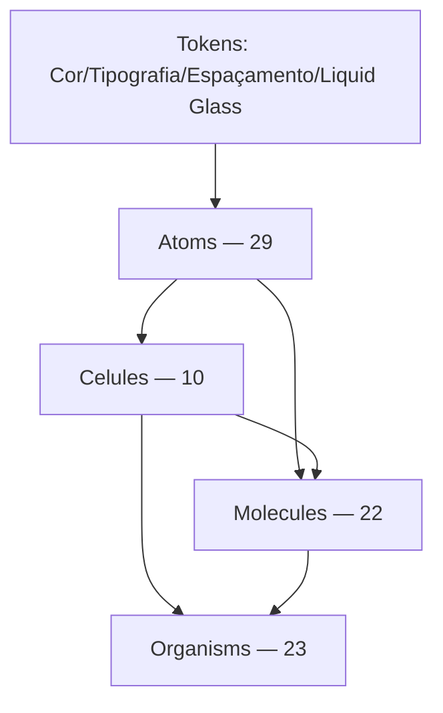

# Camadas Atômicas

O catálogo tem **84 componentes** em 4 camadas, espelhando a hierarquia real do arquivo Figma (não uma taxonomia atômica pura de livro-texto — ver a ressalva sobre `celules` abaixo).

## Atoms (29)

Elementos indivisíveis: botões de ícone (`CloseButton`, `ClearButton`, `KeepButton`...), badges (`TypeLabel`, `StorageTierBadge`, `TagOrgMode`), o [[PushButton]] único. Ver `stories/atoms/`.

## Celules (10)

**Não é typo** — nome vem literalmente do Figma (`celule/...`). Peças de composição intermediárias que não são nem um átomo isolado nem uma molécula completa: `Callout`, `TagColor`, `DropListItem`, a família `FreeMode/*` do canvas de organização (`FreeModeItemNode`, `FreeModeOutputNode`, `FreeModeButtons`, `FreeModeListItem`), `NodoContextMenuItem`, `PagesLead`, `CleanSpaceListSelection`.

## Molecules (22)

Composições funcionais reutilizáveis: [[SearchInput]], `Label`, `FileArchive`, [[FileList]], `FolderCard`, `Notification`/`PopoverNotification`, `DropdownSelectGroupBy`/`DropdownSelectLabel`, [[StorageStatus]], `StorageBar`, `ViewModeToggle`.

## Organisms (23)

Composições de tela/fluxo completo: [[Header]], [[Sidebar]], [[CleanSpaceStorage]], `ArchiveBrowserModal`, `DialogTemplateReviewModal`, [[OrganizeFreeModeCanvas]], `SaveLongTermFileStorage`, [[PlanSelection]], [[UploadPopover]], a família `Faq*`.

## Regra de composição (Regra 10)

Um componente **nunca reimplementa** a marcação de outro que já existe — sempre importa e compõe (ex.: `ArchiveItem` reusa `SelectState` pro badge de seleção; `CleanSpaceStorage` reusa `CleanSpaceListSelection`). Violações viram achado de auditoria.

## Padrão de documentação por componente

Cada `.mdx` segue a mesma estrutura: título + node Figma, seção **## Uso** (o que é, quando usar, como não confundir com peças parecidas — adicionada em massa na [[Sessão 2026-08-15]]), status de alinhamento, checklist elemento-a-elemento (Regra 11), estados (Regra 8 — fluid interface), terminologia, material.

## Ver também

- [[Fonte Figma]]
- [[Regra 11 - Protocolo de Verificação]]
- [[Estrutura de Pastas]]
