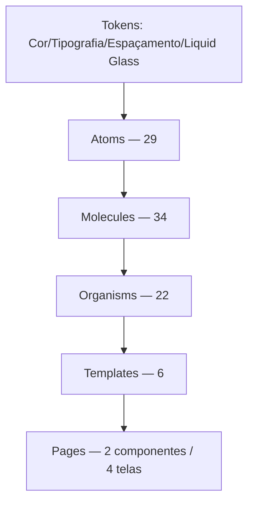

# Camadas Atômicas

O catálogo tem **93 componentes** em 5 camadas, espelhando a hierarquia real do arquivo Figma. Até 2026-08-19 eram só 3 (atoms/molecules/organisms, "não uma taxonomia atômica pura de livro-texto, que também teria templates/pages") — em 2026-08-20 o usuário introduziu `template/` e `page/` reais no Figma fonte (ver notas abaixo), fechando a lacuna por completo. `pages` começou com 4 das 23 telas do node "Pages" (`1439:25740`) — as outras 19 ficam pra reconciliação futura, priorizadas junto com o usuário (ver [[Sessão 2026-08-20]]).

## Atoms (29)

Elementos indivisíveis: botões de ícone (`CloseButton`, `ClearButton`, `KeepButton`...), badges (`TypeLabel`, `StorageTierBadge`, `TagOrgMode`), o [[PushButton]] único. Ver `stories/atoms/`.

## Molecules (34)

Composições funcionais reutilizáveis: [[SearchInput]], `Label` (consolida o antigo `DropdownSelectLabel`, 2026-08-18), `FileArchiveCard`, [[FileList]], `FolderCard`, `Notification`/`PopoverNotification`, `DropdownSelectGroupBy`, [[StorageStatus]], `StorageBar`, `ViewModeToggle`, e mais 10 vindas de uma camada `Cells` extinta em 2026-08-20 (ver nota abaixo): `Callout`, `TagColor`, `DropListItem`, a família `OrganizeFreeModeCanvas/*` (`ItemNode`, `OutputNode`, `Buttons`, `ListItem`), `NodeContextMenuItem`, `PageLead`, `CleanSpaceListSelection`. Mais 2 novas em 2026-08-20: `FreeModeAddMenu` (`molecule/Menuitem/freemodeOrganization`), extraída do markup inline do canvas Modo Livre; `Breadcrumb`, extraída do markup inline das páginas `Home/*` (sem node Figma próprio, nome de layer fora da convenção).

### Nota histórica: extinção da camada `Cells` (2026-08-20)

Até 2026-08-19 essas 10 peças viviam numa 4ª camada, `cells` (espelhando o prefixo `celule/...` do arquivo Figma fonte — `making-of/figma-inventory.md`, achado #7). **Decisão do usuário**: `celule` foi um erro de nomenclatura no próprio Figma, não uma categoria real — todas as 10 peças eram moléculas. Código, stories e docs foram movidos pra `molecules/`; o Figma ainda não foi corrigido (ajuste manual planejado pelo usuário pra depois de propagar aqui primeiro). Enquanto isso não acontece, os comentários desses componentes continuam citando `celule/...` como nome literal do Figma (Regra 9) — não é resíduo esquecido, é o estado real da fonte até a correção manual.

## Organisms (22)

Composições de escopo intermediário — compõem atoms/molecules, e desde 2026-08-20 também são compostas *por* templates (ver abaixo): [[Header]], [[Sidebar]], [[PlanSelection]], [[UploadPopover]], a família `Faq/*`. Mais 5 novas em 2026-08-20, extraídas de dentro dos 6 templates promovidos (Regra 10 — nunca reimplementar): `CleanSpaceLargeFiles`, `CleanSpaceDuplicated`, `TemplateReviewModalItem`, `ArchiveBrowserModalSidebar`, `SaveLongTermFileStorageSelectedFiles`.

## Templates (6) — camada nova em 2026-08-20

Fluxos/modais de tela completa — o usuário renomeou estes 6 nodes no Figma de `organism/*` pra `template/*` (mesmos nodeIds, ver `making-of/conflicts.md`/`making-of/figma-inventory.md` pro achado original): [[CleanSpaceStorage]] (`template/cleanSpaceStorage`, `1439:16908`), `ArchiveBrowserModal` (`1439:16909`), `SaveLongTermFileStorage` (`1439:16907`), [[OrganizeFreeModeCanvas]] (`template/MainCanvas/Organization/FreeMode`, `1439:16906`), `SaveOrganizationModal` (`template/DialogSave/OrganizationModal`, `1421:18576`), `TemplateReviewModal` (`template/Dialog/TemplateReviewModal`, `1431:20397`). Código movido pra `src/components/templates/`, stories pra `Templates/*` no Storybook.

**Achado 2026-08-20**: 1 sub-peça do canvas Modo Livre (`celule/MainCanvas/Organization/FreeMode/Buttons`, `1431:20043`) segue com o nome antigo `celule/` no Figma — das 10 peças da extinta camada `Cells`, é a única ainda não renomeada `molecule/` na fonte. Ver [[Conflitos Abertos]] (fonte completa em `making-of/conflicts.md`).

## Pages (2 componentes, 4 das 23 telas) — camada nova em 2026-08-20

Telas completas de aplicação — o node "Pages" (`1439:25740`) também ganhou prefixo `page/*` em quase todos os 23 frames (2 exceções de nomenclatura registradas em `making-of/checkpoints.md` e [[Conflitos Abertos]]). Implementadas até agora, priorizadas com o usuário: `HomePage` (um componente parametrizado por `viewMode`, cobrindo os 3 nodes `page/Home/GridMode`/`ListMode`/`Columns Mode/Item1` — mesmo critério de eixo único já usado em `ViewModeToggle`/`Header`/`Sidebar`) e `OrganizationPage` (`page/Organização`, com `Templates/SaveOrganizationModal` em overlay). Ambas compõem só peças já existentes no catálogo — nenhum componente novo de atoms/molecules/organisms/templates foi necessário. As outras 19 telas (Settings×7, FAQ×2, Payment×2, Function Storage Status×3, Home-List-Selected, Kandrive Login, Organização-ModoData×2) ficam para uma próxima rodada.

Nova peça de suporte: `molecule/Breadcrumb` (não tinha node Figma próprio — nome de layer "Navigation - Breadcrumb" fora da convenção, ver achado #7-adjacente do inventário) — trilha usada no topo das páginas `Home/*`.

## Regra de composição (Regra 10)

Um componente **nunca reimplementa** a marcação de outro que já existe — sempre importa e compõe (ex.: `ArchiveItem` reusa `SelectState` pro badge de seleção; `CleanSpaceStorage` reusa `CleanSpaceListSelection`). Violações viram achado de auditoria.

## Padrão de documentação por componente

Cada `.mdx` segue a mesma estrutura: título + node Figma, seção **## Uso** (o que é, quando usar, como não confundir com peças parecidas — adicionada em massa na [[Sessão 2026-08-15]]), status de alinhamento, checklist elemento-a-elemento (Regra 11), estados (Regra 8 — fluid interface), terminologia, material.

## Ver também

- [[Fonte Figma]]
- [[Regra 11 - Protocolo de Verificação]]
- [[Estrutura de Pastas]]
