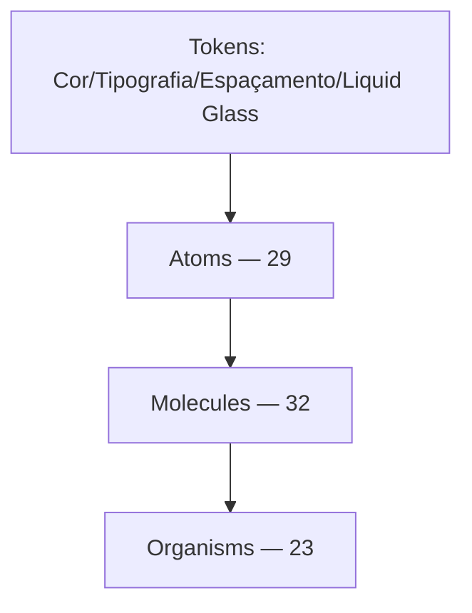

# Camadas Atômicas

O catálogo tem **84 componentes** em 3 camadas, espelhando a hierarquia real do arquivo Figma pra atoms/molecules/organisms (não uma taxonomia atômica pura de livro-texto, que também teria templates/pages).

## Atoms (29)

Elementos indivisíveis: botões de ícone (`CloseButton`, `ClearButton`, `KeepButton`...), badges (`TypeLabel`, `StorageTierBadge`, `TagOrgMode`), o [[PushButton]] único. Ver `stories/atoms/`.

## Molecules (32)

Composições funcionais reutilizáveis: [[SearchInput]], `Label` (consolida o antigo `DropdownSelectLabel`, 2026-08-18), `FileArchiveCard`, [[FileList]], `FolderCard`, `Notification`/`PopoverNotification`, `DropdownSelectGroupBy`, [[StorageStatus]], `StorageBar`, `ViewModeToggle`, e mais 10 vindas de uma camada `Cells` extinta em 2026-08-20 (ver nota abaixo): `Callout`, `TagColor`, `DropListItem`, a família `OrganizeFreeModeCanvas/*` (`ItemNode`, `OutputNode`, `Buttons`, `ListItem`), `NodeContextMenuItem`, `PageLead`, `CleanSpaceListSelection`.

### Nota histórica: extinção da camada `Cells` (2026-08-20)

Até 2026-08-19 essas 10 peças viviam numa 4ª camada, `cells` (espelhando o prefixo `celule/...` do arquivo Figma fonte — `docs/figma-inventory.md`, achado #7). **Decisão do usuário**: `celule` foi um erro de nomenclatura no próprio Figma, não uma categoria real — todas as 10 peças eram moléculas. Código, stories e docs foram movidos pra `molecules/`; o Figma ainda não foi corrigido (ajuste manual planejado pelo usuário pra depois de propagar aqui primeiro). Enquanto isso não acontece, os comentários desses componentes continuam citando `celule/...` como nome literal do Figma (Regra 9) — não é resíduo esquecido, é o estado real da fonte até a correção manual.

## Organisms (23)

Composições de tela/fluxo completo: [[Header]], [[Sidebar]], [[CleanSpaceStorage]], `ArchiveBrowserModal`, `TemplateReviewModal`, [[OrganizeFreeModeCanvas]], `SaveLongTermFileStorage`, [[PlanSelection]], [[UploadPopover]], a família `Faq/*`.

## Regra de composição (Regra 10)

Um componente **nunca reimplementa** a marcação de outro que já existe — sempre importa e compõe (ex.: `ArchiveItem` reusa `SelectState` pro badge de seleção; `CleanSpaceStorage` reusa `CleanSpaceListSelection`). Violações viram achado de auditoria.

## Padrão de documentação por componente

Cada `.mdx` segue a mesma estrutura: título + node Figma, seção **## Uso** (o que é, quando usar, como não confundir com peças parecidas — adicionada em massa na [[Sessão 2026-08-15]]), status de alinhamento, checklist elemento-a-elemento (Regra 11), estados (Regra 8 — fluid interface), terminologia, material.

## Ver também

- [[Fonte Figma]]
- [[Regra 11 - Protocolo de Verificação]]
- [[Estrutura de Pastas]]
